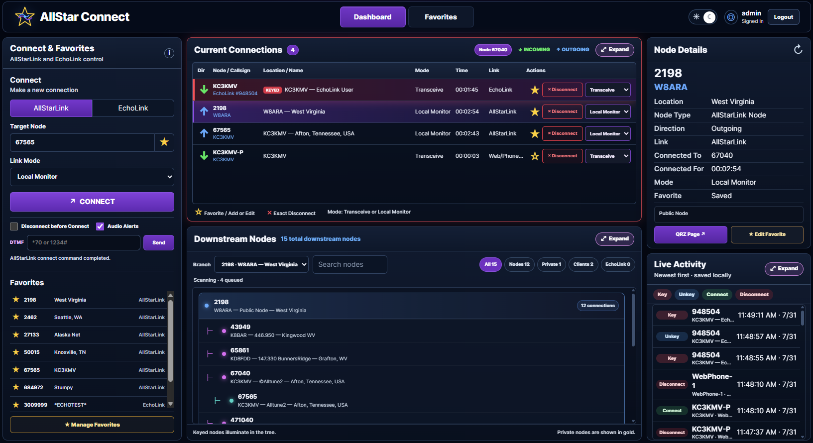
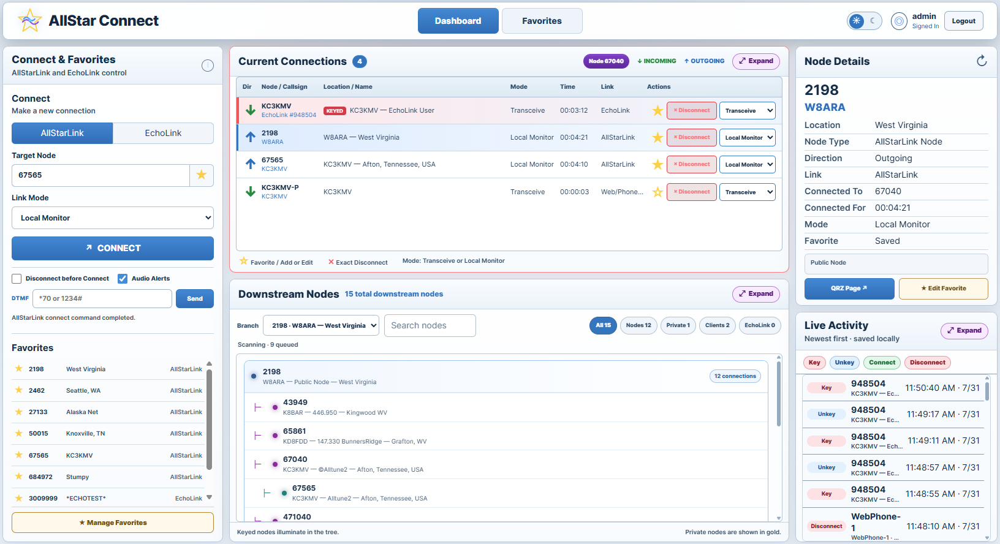

# AllStar Connect

AllStar Connect is a web dashboard for controlling and monitoring an ASL3 node. It focuses on AllStarLink and EchoLink connections, with live status, exact link controls, Favorites, downstream viewing, and optional login protection. Tested on Debian 13.

## What you can do

- Connect to an AllStarLink node.
- Search AllStarLink and EchoLink targets by callsign.
- Connect to a mapped EchoLink node.
- Choose **Transceive** or **Local Monitor** when connecting.
- Change the mode of a supported live connection.
- Disconnect one exact AllStarLink, EchoLink, IAX, or Web/Phone connection.
- View incoming and outgoing connections, keyed activity, callsigns, descriptions, and locations.
- View downstream branches from the dashboard's cached scanner data.
- Expand Current Connections, Downstream Nodes, and Live Activity into movable and resizable desktop windows.
- Save, search, sort, edit, remove, and load Favorites.
- Save a live connection or manual target directly from the dashboard.
- Send protected DTMF commands.
- Optionally disconnect existing links before starting a new connection.
- Use spoken connection and disconnection alerts.
- Switch between dark and light themes.
- Enable an optional administrator login for control access.

The header logo opens the project repository. When a newer release is available, the star in the logo lights up.

## Screenshots

<p align="center">
  <a href="screenshot.png"></a>
</p>

<p align="center">
  <a href="screenshot-light.png"></a>
</p>

## How it works

AllStar Connect reads live Asterisk and app_rpt information through restricted helper scripts. The web server can run only the helper actions allowed by the installed sudoers rules.

The dashboard refreshes local connection status and keeps its downstream and EchoLink identity data in bounded local caches. Successful high-frequency polling requests are excluded from Apache's normal access log, while errors and control requests remain logged.

### Callsign search

In **Connect - Target**, type a callsign and press **Enter** or click the **magnifying glass**. AllStar Connect searches both AllStarLink and EchoLink. AllStarLink nodes are shown under the AllStarLink tab and EchoLink matches under EchoLink. Select the station you want, then connect to it or add it to Favorites. Press **Escape** to clear the search and results.

AllStarLink callsign search uses ASL3's local `/var/lib/asterisk/astdb.txt` node directory. A listed node may be offline or unavailable, so appearing in the results does not guarantee that it can be connected. EchoLink search can return the base callsign and matching `-R` and `-L` variants when available.

### DTMF Favorites

Use **DTMF Favorites** to save the DTMF commands you use most often with a name, so they can be sent quickly from the Dashboard without typing the code every time.

### EchoLink protection

AllStar Connect uses a protected EchoLink sequence:

- only one dashboard-started outgoing EchoLink connection is allowed;
- incoming EchoLink callers are not limited by the dashboard;
- a new outgoing connection is blocked when resetting the module could interrupt an incoming caller;
- an incoming disconnect never resets the EchoLink module;
- an outgoing disconnect resets the module only after EchoLink is confirmed idle and the module use count is zero;
- the row and audio announcement remain pending until the protected operation finishes.

Incoming EchoLink capacity is controlled by your existing Asterisk EchoLink configuration.

## Requirements

Before installing, the system should already have:

- a working ASL3 and app_rpt node;
- Apache and PHP;
- Asterisk at `/usr/sbin/asterisk`;
- working EchoLink configuration when EchoLink will be used;
- network access for AllStarLink and EchoLink identity lookups.

AllStar Connect is a controller and monitor. It does not repair an incomplete ASL3 or EchoLink installation.

## First-time installation

```bash
cd /var/www/html
sudo git clone https://github.com/TerryClaiborne/allstar_connect.git allstar_connect
cd allstar_connect
sudo ./setup_allstar_connect.sh
```

Open:

```text
http://YOUR-NODE-IP-ADDRESS/allstar_connect/public/
```

The installer attempts to detect one local app_rpt node from the Asterisk configuration. When detection is not unambiguous, edit:

```text
/var/www/html/allstar_connect/config.ini
```

and set:

```ini
MYNODE="YOUR-NODE-NUMBER"
```

Then run setup again:

```bash
sudo /var/www/html/allstar_connect/setup_allstar_connect.sh
```

## Updating

```bash
cd /var/www/html/allstar_connect
sudo git pull origin main
sudo ./setup_allstar_connect.sh
```

## Optional web login

AllStar Connect uses one optional administrator account for control access. A fresh installation starts with web login disabled, so protect the dashboard with HTTPS, a trusted VPN, or an administrator password before exposing it outside a trusted network.

Set or change the administrator password and enable login:

```bash
sudo /var/www/html/allstar_connect/setup_allstar_connect.sh --set-admin-password
```

Re-enable login using the saved password hash:

```bash
sudo /var/www/html/allstar_connect/setup_allstar_connect.sh --enable-auth
```

Disable login while preserving the saved password hash:

```bash
sudo /var/www/html/allstar_connect/setup_allstar_connect.sh --disable-auth
```

When login is enabled, signed-out users can view the dashboard but cannot Connect, Disconnect, change modes, send DTMF, or change Favorites.

### Login settings in config.ini

`ALLSTAR_CONNECT_AUTH_ENABLED` controls the optional web login.

Use:

```ini
ALLSTAR_CONNECT_AUTH_ENABLED=0
```

to keep AllStar Connect in normal no-login mode.

Use:

```ini
ALLSTAR_CONNECT_AUTH_ENABLED=1
```

to require login before users can control the node.

`ALLSTAR_CONNECT_ADMIN_USER` is the single web login username. The default is:

```ini
ALLSTAR_CONNECT_ADMIN_USER="admin"
```

`ALLSTAR_CONNECT_ADMIN_PASSWORD_HASH` stores the password hash used by the web login. Do not type a plain password into this setting.

Create or change the hash with:

```bash
sudo /var/www/html/allstar_connect/setup_allstar_connect.sh --set-admin-password
```

The setup script creates the hash automatically. The plain password is not stored.

## Favorites

Favorites can be opened from the dashboard.

Type a callsign into **Search Favorites or Find a Station** and AllStar Connect automatically looks for matching AllStarLink and EchoLink stations. If the callsign has more than one node or EchoLink entry, the available choices are shown so you can pick the one you want. Use **+ Add Favorite** for a station that is not saved, or **Edit Saved Favorite** for one that is already in your Favorites.

You can also type a node number. **Add Node** adds an unsaved node, while **Edit Saved** opens a node that is already saved. With the search box empty, **Add Node** opens manual entry. Saved Favorites can still be searched, sorted, loaded, edited, and removed.

## Local data and logs

Your node configuration, saved Favorites, and login settings remain local to the node.

Application activity is written to:

```text
/var/log/allstar-connect/activity.log
```

The installer configures daily rotation, keeps one uncompressed rotated log for no more than one day, and rotates it early if it reaches 5 MB.
